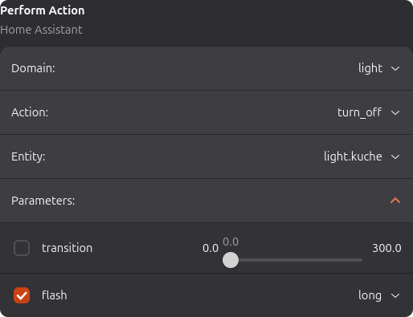
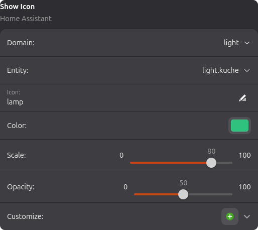
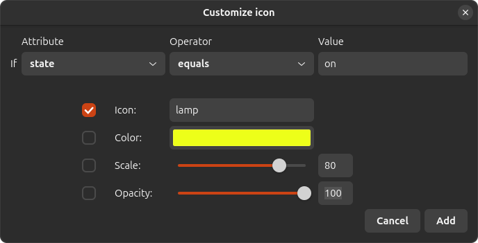
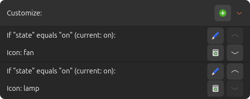
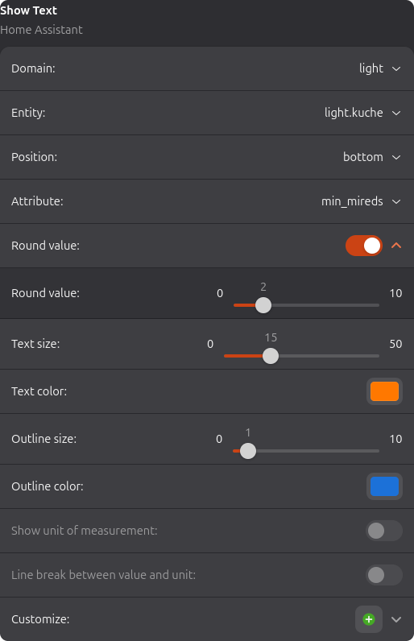
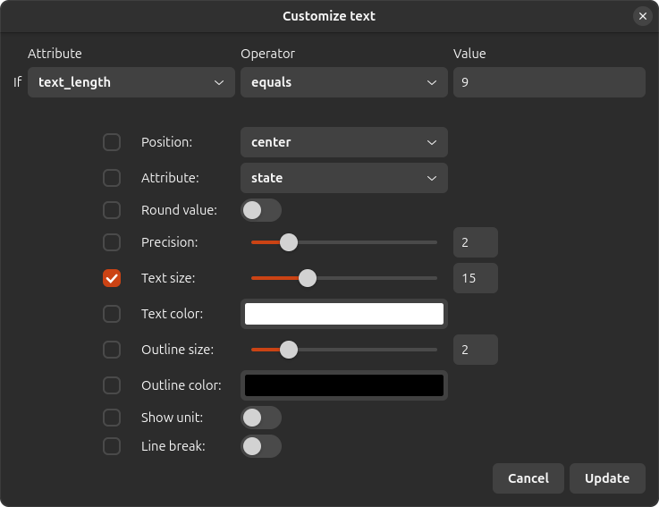
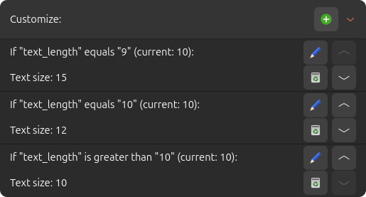

# HomeAssistantPlugin for [StreamController](https://github.com/StreamController/StreamController)

Control your Home Assistant instance from your StreamDeck

__This is no official plugin - I have no affiliation with Home Assistant, StreamDeck or StreamController.__

## Prerequisites

* `websocket_api` must be present in your `configuration.yaml`. Remember to restart Home Assistant after updating your
  configuration.
* You need a _long-lived access token_ to connect to Home Assistant. To create one, go to your user profile and click on
  the _Security_ tab. All the way at the bottom of the page is a button to create a new token. You can only see/copy the
  token immediately after creating it. Once you dismiss the dialog, you won't be able to retrieve the token.  
  __Be very careful with your Home Assistant information and your token. If your Home Assistant instance is accessible
  from the internet, anyone with this information can access and control your Home Assistant instance.__

## Features

* Perform an action
    * Parameters for the action can be provided
    * The action is always called on `key_down`, i.e. immediately when the button is pressed
        * To change this behavior, the built-in `Event Assigner` can be used to
            * map other events to `key_down`, if you want to call the service on a different event (multiple events are
              possible)
            * map `key_down` to `None`, if you don't want to call the service on `key_down`
* Show an icon
    * This can be the entity icon or a custom icon
    * Color, scale and opacity of the icon can be customized
    * All icon settings can also be customized based on state or attribute values
        * Customizations are reevaluated when the entity is updated
* Show text
    * This can be the entity state, an attribute value or custom text
    * If the entity's state changes, the text is updated on the StreamDeck
    * Position, text size, text color, outline size and outline color of the text can be customized
    * Optionally show the unit of measurement (with or without line break)
    * All text settings can also be customized based on state or attribute values
        * Customizations are reevaluated when the entity is updated

## Documentation

### Plugin settings

To open the Home Assistant plugin settings, open your _StreamController settings_ and select the tab
_Plugins_. Look for the entry for _Home Assistant_ and click _Open Settings_.

Once all necessary information is entered, the plugin automatically tries to connect to Home
Assistant. If you are using a self-signed certificate, you should disable _Verify certificate_
or the connection will fail.  
If the connection can't be established or is lost, the plugin automatically tries to reconnect to the server every 10
seconds.

### Perform action

This action allows you to perform an action in Home Assistant.

You can pick the action and optionally an entity, if the action requires one. Parameters for the action are also
optional but the list of parameters contains all possible parameters for the action; this does not guarantee, that the
entity supports the parameter.  
Only parameters that have their checkbox checked are included when performing the action.

### Show icon

This action allows you to show an icon based on Home Assistant data.

After picking in entity, by default this shows the icon defined in Home Assistant for the entity; or nothing, if no
icon is defined. In the _Icon_ field you can define an icon which overrides the setting from Home Assistant.
Valid are all icons from the [Material Design Icon](https://pictogrammers.com/library/mdi/) collection.  
You can also adapt color, scale and opacity of the icon there.

#### Show icon customization

To create a new icon customization, click the button (
)  in the _Customize_
row. A new window opens where you can enter a condition and how the icon should change if the
condition is met.

Only settings whose checkbox is checked are honored.  
When you have created customizations, they are shown under _Customize_.

Customizations are cascading and evaluated in order. This means, multiple customizations might have
conditions that are met, but the latest matching customization sets the eventual value for an
option. In the example above, both customizations' conditions are met, but the icon shown would be
_lamp_ as this is the latest matching customization.  
For convenience, the current value that the condition is evaluated against, is also shown, and with
the buttons, you can edit, delete and rearrange your customizations.

### Show text

This action allows you to show text based on Home Assistant data.

After picking an entity, you can configure how the text is shown.  
With _Position_ you can change where on the key the text is shown. _Attribute_ allows you to change
what value of the entity is displayed; either the state, or the value of an attribute.  
When _Round value_ is active, the plugin tries to convert the value to a float number and round it
to the defined _Precision_. This has no effect if the value cannot be converted.  
_Text size_ and _Outline size_ change the size of the text and the outline respectively and the same
goes for _Text color_ and _Outline color_ but for color.  
If the entity state is picked to be displayed and the entity has a unit of measurement set in Home
Assistant, the option _Show unit of measurement_ becomes available. When the option is activated,
additionally the option _Line break between value and unit_ becomes available as well. They do
exactly what the labels say.

#### Show text customization

To create a new text customization, click the button (
)  in the _Customize_
row. A new window opens where you can enter a condition and how the text should change if the
condition is met.

Only settings whose checkbox is checked are honored.  
When you have created customizations, they are shown under _Customize_.

Just as with icon customization, text customizations are cascading and evaluated in order.
This means, multiple customizations might have conditions that are met, but the latest matching
customization sets the eventual value for an option. In the example above, only the second
customization matches the condition so the text size is set to 12.  
As an `Attribute` you can also select `custom_text` which shows a new field where you can enter any text to be displayed
instead of the original. This allows you to create your own translations on the Stream Deck. Furthermore, `%s` in the
`custom_text` field is replaced by the original text and `\n` creates a line break. As an example: on a weather entity
that has an attribute for the temperature you can select the temperature to be displayed and then create a customization
with custom text `%s\n°C` which results in the temperature being displayed in the first line and "°C" in the second.  
For convenience, the current value that the condition is evaluated against, is also shown, and with
the buttons, you can edit, delete and rearrange your customizations.

## Examples

### Weather button

  
Action _Show text_ used with a weather entity.

### Toggle button

  
Action _Show icon_ and action _Perform action_ used with the same _input_boolean_ entity. _Show icon_ is customized to change the icon color to yellow when the _input_boolean_ is _on_. _Perform action_ toggles the _input_boolean_'s state.

### Media Player button

  
Action _Show icon_, action _Perform action_ and two actions _Show text_ used with the same media player entity. _Show icon_ shows the custom icon _play_ except when the media player is _playing_, then it shows the custom icon _pause_. _Perform action_ performs the action _media_play_pause_ on the media player entity. The two _Show text_ actions show the media title and artist respectively.

### Air quality button

  
Action _Show text_, action _Perform action_ and action _Show icon_ used with a CO2 sensor and a ventilator entity respectively. _Show text_ shows the CO2 sensor value with unit of measurement and line break between value and unit. _Show icon_ shows the ventilator icon at 50% opacity. _Perform action_ toggles the ventilator on/off.

## Planned features

* None at the moment

## Problems?

* Please open a [GitHub issue](https://github.com/gensyn/HomeAssistantPlugin/issues).
